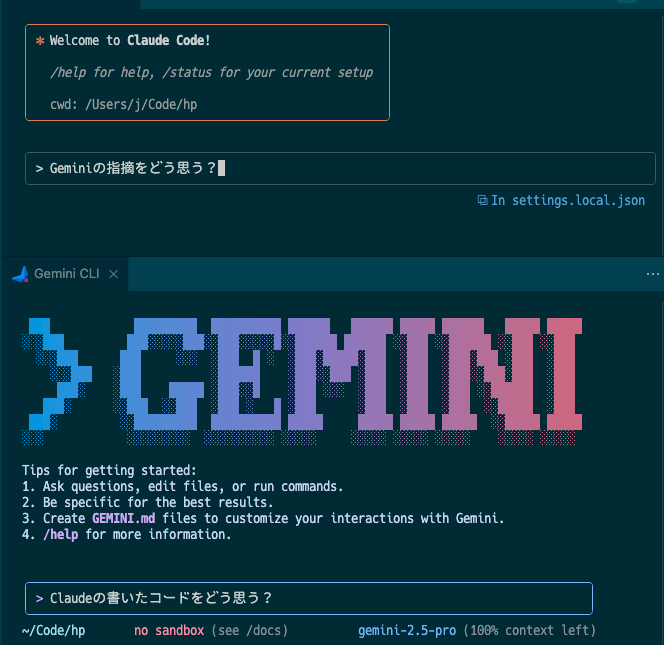

# Gemini CLI on VSCode

[🇯🇵 日本語版](README-ja.md) | **🇺🇸 English**

## 🎨 Gemini CLI Running in Editor Windows

### Finally: The Same Claude Code Experience with Gemini CLI



## 💡 Why This Extension is Revolutionary

- ❌ Traditional: Gemini CLI only runs in terminal
- ✅ Innovation: Editor integration with Claude Code-like experience

### 🔄 Traditional Limitations

- **Gemini CLI**: Powerful but **only runs in terminal panels**
- **Gemini Code Assist**: Editor integrated but **a different tool entirely**
- **Claude Code**: Perfect editor integration but **can't use Gemini**

### ✨ This Extension's Innovation

#### Brings Claude Code's editor integration experience to Gemini CLI

- Gemini CLI runs directly in editor windows
- No more switching between terminal and editor
- The exact workflow Claude Code users love, now with Gemini

## ⚡ Key Features

### 🖱️ One-Click Launch

- **Editor title bar icon** for instant access
- **Command palette** integration
- Choose between **new pane** or **active pane**

### 🔧 True Editor Integration

- Opens as an editor tab, not a terminal panel
- Side-by-side with your code files
- Maintains your editor layout

### 💻 Seamless Workflow

- Keep your code visible while using AI assistance
- No context switching between terminal and editor
- Natural integration with your development flow

### 🆕 Smart Features

**v0.0.5** 🎯 NEW
- **Send File/Folder Paths**: Send any file or folder to Gemini CLI
  - Right-click in Explorer → "Send File Path" (supports multiple selection)
  - Right-click on editor tab → "Send File Path"
  - Folders can also be sent
- **Improved Command Names**: Clearer, more intuitive names
  - "Send File Path" - for selected files/folders
  - "Send Open File Path" - for all open files
  - "Send Selected Text" - for selected text

**v0.0.4**
- **Conversation History (Mock)**: Manually save Gemini CLI output
  - Status bar button for easy saving to date-based files `.gemini-history/YYYY-MM-DD.md`
- **Editor to Gemini**: Send editor text to Gemini CLI
  - Select text in editor → Right-click menu → "Send Selected Text"

**v0.0.3**
- **Send Open Files**: Send all open editor tabs to Gemini CLI at once

**v0.0.2**
- **Auto-navigation**: Automatically navigates to your workspace folder
- **Terminal reuse**: Focuses existing Gemini CLI instead of creating duplicates
- **Custom keybindings**: Set your own keyboard shortcuts

## 🚀 Quick Start

### Prerequisites

```bash
# Install Gemini CLI (required)
npm install -g @google/gemini-cli

# Authenticate (first time only)
gemini
# Complete Google account authentication in browser
```

### Usage

1. **Open any project in VS Code**
2. **Click the ✨ (sparkle) icon** in the editor title bar
3. **Gemini CLI launches in a new editor pane!**

Or use Command Palette:

1. **Press `Cmd+Shift+P` (Mac) or `Ctrl+Shift+P` (Windows/Linux)**
2. **Search for "Gemini CLI"**
3. **Choose your preferred launch mode**

### ⌨️ Custom Keyboard Shortcuts (Optional)

Set your own keybindings:

1. Open Keyboard Shortcuts: `Cmd+K Cmd+S` (Mac) or `Ctrl+K Ctrl+S` (Windows/Linux)
2. Search for "Gemini CLI"
3. Click the pencil icon to assign your preferred keys

Recommended shortcuts that won't conflict:
- `Cmd+Shift+Alt+G` (Mac) / `Ctrl+Shift+Alt+G` (Windows/Linux)
- `Cmd+K G` (Mac) / `Ctrl+K G` (Windows/Linux)

### 📁 Send Files/Folders to Gemini CLI

**Send from Explorer**
- Right-click file or folder
- Select "Gemini CLI: Send File Path"
- Supports multiple selection (Ctrl/Cmd+click)

**Send from Editor Tab**
- Right-click on editor tab
- Select "Gemini CLI: Send File Path"

**Send All Open Files**
- Right-click in editor
- Select "Gemini CLI: Send Open File Path"

All paths are sent with `@` prefix to Gemini CLI. Multiple selections are automatically space-separated.

### 💾 Save Conversation History

Save important Gemini CLI conversations to `.gemini-history/YYYY-MM-DD.md`:

**From Gemini CLI Terminal:**
- Select text → Click "Save to History" button in status bar

**Custom Keyboard Shortcut:**
- Set your own in VSCode Keyboard Shortcuts settings

### 📤 Send to Gemini

**Send Selected Text:**
- Select text in editor → Right-click → "Gemini CLI: Send Selected Text"
- Or set a custom keyboard shortcut in settings

**Send File/Folder Paths:**
- Right-click in Explorer → "Gemini CLI: Send File Path"
- Supports multiple selection and folders

**Send All Open Files:**
- Right-click in editor → "Gemini CLI: Send Open File Path"
- All open file paths are sent with @ prefix

### ⌨️ Command Palette

All features are also available from the Command Palette:

- Open Command Palette (`Cmd+Shift+P` / `Ctrl+Shift+P`)
- "Gemini CLI: Send File Path" - Send files/folders
- "Gemini CLI: Send Open File Path" - Send all open files
- "Gemini CLI: Send Selected Text" - Send selected text
- "Gemini CLI: Save to History" - Save conversation

## 💡 Real-World Usage Examples

### Code Review Request

```bash
# After Gemini CLI launches in editor pane
@src/components/Button.tsx Review this component and suggest improvements
```

### Project Architecture Analysis

```bash
@. Analyze the project architecture and explain the main design patterns
```

### Error Resolution

```bash
@package.json @src/main.ts I'm getting build errors. Help me fix them
```

## 🆚 Why Choose This Over Alternatives?

### 🎯 Perfect For

- **Developers who love Claude Code's UX** but want to use Gemini
- **Power users** who prefer terminal-based AI tools
- **Anyone tired** of switching between terminal and editor
- **Teams** already using Gemini CLI

### 📊 Comparison

| Feature | Gemini CLI | This Extension | Gemini Code Assist | Claude Code |
|---------|-----------|----------------|-------------------|-------------|
| **Code generation** | ✅ | ✅ | ✅ | ✅ |
| **Runs in editor pane** | ❌ (terminal) | ✅ | ❌ (sidebar) | ✅ |
| **One-click launch** | ❌ | ✅ | ✅ | ✅ |
| **Terminal-based interface** | ✅ | ✅ | ❌ | ✅ |
| **File context (@)** | ✅ | ✅ | ✅ | ✅ |
| **Send editor text** | ❌ | ✅ | ✅ | ❌ (Separate terminal) |
| **Send multiple files** | ❌ | ✅ | ✅ | ❌ |
| **Conversation history** | ❌ | ✅ (Manual) | ✅ | ✅ (JSON) |
| **Uses Gemini models** | ✅ | ✅ | ✅ | ❌ |

## 🛠️ Development

### Local Development

```bash
git clone https://github.com/d3j/gemini-cli-on-vscode.git
cd gemini-cli-on-vscode
npm install
npm run compile
```

### Debugging

1. Open the project in VS Code
2. Press `F5` to launch Extension Development Host
3. Test the extension in the new VS Code window

## 🐛 Troubleshooting

### Common Issues

#### Q: "gemini: command not found" error

```bash
# Solution: Install Gemini CLI
npm install -g @google/gemini-cli
```

#### Q: Authentication error

```bash
# Solution: Authenticate directly in terminal first
gemini
# Complete browser authentication, then retry extension
```

#### Q: Extension not appearing in editor title bar

- Ensure you have an active editor open
- Try reloading VS Code window (`Cmd+R` / `Ctrl+R`)

## 🤝 Contributing

Bug reports, feature requests, and pull requests are welcome!

- **Bug Reports**: [Issues](https://github.com/d3j/gemini-cli-on-vscode/issues)
- **Feature Requests**: [Issues](https://github.com/d3j/gemini-cli-on-vscode/issues)
- **Pull Requests**: [Pull Requests](https://github.com/d3j/gemini-cli-on-vscode/pulls)

## 🙏 Acknowledgments

- [Gemini CLI](https://github.com/google-gemini/gemini-cli) by Google
- [Claude Code](https://claude.ai/claude-code) by Anthropic
- VS Code Extension developer community

---

## 📈 If You Like This Extension

⭐ **Please star on GitHub!**
🐛 **Report any bugs you find**
💡 **Share your feature ideas**
📢 **Share with your team**

[⭐ Star on GitHub](https://github.com/d3j/gemini-cli-on-vscode) | [🐛 Report Bug](https://github.com/d3j/gemini-cli-on-vscode/issues) | [💡 Request Feature](https://github.com/d3j/gemini-cli-on-vscode/issues)

## 📄 License

MIT License - See [LICENSE](LICENSE) file for details

## 👤 Author

**Joji Jorge Senda** ([@d3j](https://github.com/d3j))

---

Born from the daily frustration of switching between terminal and editor while using AI coding assistants. This extension brings the best of both worlds - Claude Code's elegant editor integration with Gemini CLI's powerful capabilities. This documentation expects to make a mundane extension seem like a world-changing feature. But maybe that's okay. If a small tool solves someone's small problem, the world becomes a little better.
