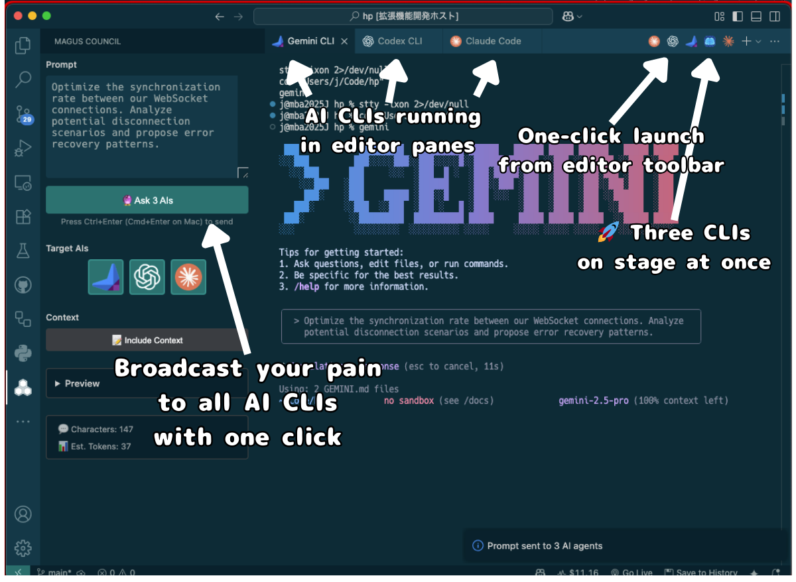

# Gemini CLI on VSCode ?

[🇯🇵 日本語版](README-ja.md) | **🇺🇸 English**

## 🔮 MAGUS Council - Unified AI CLI Management



### Finally: The Same Claude Code Experience with Gemini CLI & Codex CLI (GPT-5)

## 💡 Why This Extension is Revolutionary

- ❌ Traditional: Gemini CLI and Codex CLI only run in terminal
- ✅ Innovation: Unified AI management system with editor integration

### 🔄 Traditional Limitations

- **Gemini CLI / Codex CLI**: Powerful but **only runs in terminal panels**
- **Gemini Code Assist**: Editor integrated but **a different tool entirely**
- **Claude Code**: Perfect editor integration but **can't use Gemini or GPT-5**

### ✨ This Extension's Innovation

#### Brings Claude Code's editor integration experience to multiple AI CLIs

- Gemini, Codex, and Qwen run directly in editor windows
- **MAGUS Council** enables broadcasting single prompts to multiple AI CLIs

## ⚡ Key Features

### 🖱️ One-Click Launch

- **4 AI types** for batch and individual launch
- **Editor title bar icon** for instant access
- **Command palette** integration
- Choose between **new pane** or **active pane**

### 🔧 True Editor Integration

- Opens as an editor tab, not a terminal panel
- Side-by-side with your code files
- Maintains your editor layout

### 💻 Seamless Workflow

- Keep your code visible while using AI assistance
- No context switching between terminal and editor
- Natural integration with your development flow

### 🔮 v0.1.0 Major Update - MAGUS Council

- **MAGUS Council** - Multiple Agent Guidance & Intelligence System 🔮
  - **Unified prompt broadcasting**: Operate Gemini, Claude, Codex, and Qwen in perfect synchronization
  - **All according to the scenario**: Optimized execution timing for each AI type

### 🎨 Other Key Features

- **Claude Code Integration**: Complete integration of multiple AI CLIs
- **Batch Launch**: "Launch All CLIs" button starts multiple CLIs simultaneously
- **Universal History**: Unified history folder `.history-memo/` for work logs
- **Individual CLI Commands**: Dedicated commands for each CLI
- **Advanced Settings**: Enable/disable CLIs, menu visibility control, etc.

## 🚀 Quick Start

### Prerequisites

```bash
# Install Gemini CLI (for Gemini)
npm install -g @google/gemini-cli
gemini  # Google account authentication

# Install Codex CLI (for GPT-5)
npm install -g codex
codex   # OpenAI account authentication

# Install Claude CLI (for Claude)
npm install -g @anthropic-ai/claude-cli
claude  # Anthropic account authentication

# Install Qwen CLI (for Qwen)
npm install -g @qwen-code/qwen-code@latest
qwen    # Qwen account authentication
```

### Usage

1. **Open any project in VS Code**
2. **Click the icon in the editor title bar**
   - 🚀 **Launch All CLIs** - Launch all configured CLIs at once
   - ✨ Launch Gemini CLI
   - ❄️ Launch Codex CLI
   - ✴️ Launch Claude Code
   - 🐉 Launch Qwen Code
3. **Launch MAGUS Council**
   - MAGUS Council panel appears in sidebar
   - Command Palette: "MAGUS Council: Open"
4. **Select desired AIs and send prompts**
   - Multiple AI selection enables simultaneous execution

### 🎨 Customizing Editor Title Bar Buttons

**To hide buttons:**
- **Right-click** on any button in the editor title bar
- **Uncheck** the command from the menu

**To show buttons again:**
- **Right-click** on empty space in the editor title bar  
- **Check** the hidden commands in the menu

💡 **Tip**: Even with buttons hidden, all features remain accessible via Command Palette (`Cmd/Ctrl+Shift+P`).

Or use Command Palette:

1. **Press `Cmd+Shift+P` (Mac) or `Ctrl+Shift+P` (Windows/Linux)**
2. **Search for "Gemini CLI" or "Codex CLI"**
3. **Choose your preferred launch mode**

### 📁 Send Files/Folders to AI CLI

**Send from Explorer**

- Right-click file or folder
- Select "Gemini CLI: Send File Path" or "Codex CLI: Send File Path"
- Supports multiple selection (Ctrl/Cmd+click)

**Send from Editor Tab**

- Right-click on editor tab
- Choose your preferred CLI command

**Send All Open Files**

- Right-click in editor
- Select "Gemini CLI: Send Open File Path" or "Codex CLI: Send Open File Path"

All paths are sent with `@` prefix to your selected CLI.

### 💾 Universal History Save

Save all terminal output to `.history-memo/YYYY-MM-DD.md`:

**From Any Terminal:**

- Select text → Click "Save to History" button in status bar
- Works with Gemini CLI, Codex CLI, bash, zsh, Claude Code, and more

**Custom Keyboard Shortcut:**

- Set your own in VSCode Keyboard Shortcuts settings

### 📤 Send to AI CLI

**Send Selected Text:**

- Select text in editor → Right-click
- "Gemini CLI: Send Selected Text" or "Codex CLI: Send Selected Text"

**Send File/Folder Paths:**

- Right-click in Explorer
- Choose your preferred CLI command
- Supports multiple selection and folders

**Send All Open Files:**

- Right-click in editor
- Choose "Send Open File Path" for your preferred CLI

### 🔮 Using MAGUS Council

**From Unified Control Panel:**

1. Open MAGUS Council panel in sidebar
2. Check desired AIs (Gemini/Claude/Codex)
3. Enter prompt
4. Click "🔮 Ask n AIs" button for batch sending

**Individual Control Also Available:**

- Direct operation from each AI tab
- Traditional file sending features
- Context menu operations

### ⌨️ Command Palette

**MAGUS Council Commands:**

- "MAGUS Council: Open" - Open unified control panel
- "Multi-AI: Ask All" - Batch send to selected AIs

**Existing Commands:**

- "Launch All CLIs" - Launch multiple CLIs at once (tabs in same group)

**CLI Commands (v0.2.1+ Hierarchical Structure):**

All commands now follow a consistent pattern: `{extension}.{cli}.{action}.{target}`

**Gemini CLI:**
- `gemini.start.newPane` - Launch Gemini in new pane
- `gemini.start.activePane` - Launch Gemini in active pane  
- `gemini.send.selectedText` - Send selected text to Gemini
- `gemini.send.filePath` - Send files/folders to Gemini
- `gemini.send.openFiles` - Send all open files to Gemini

**Codex CLI:**
- `codex.start.newPane` - Launch Codex in new pane
- `codex.start.activePane` - Launch Codex in active pane
- `codex.send.selectedText` - Send selected text to Codex
- `codex.send.filePath` - Send files/folders to Codex
- `codex.send.openFiles` - Send all open files to Codex

**Claude CLI:**
- `claude.start.newPane` - Launch Claude in new pane
- `claude.start.activePane` - Launch Claude in active pane
- `claude.send.selectedText` - Send selected text to Claude
- `claude.send.filePath` - Send files/folders to Claude
- `claude.send.openFiles` - Send all open files to Claude

**Qwen CLI:**
- `qwen.start.newPane` - Launch Qwen in new pane
- `qwen.start.activePane` - Launch Qwen in active pane
- `qwen.send.selectedText` - Send selected text to Qwen
- `qwen.send.filePath` - Send files/folders to Qwen
- `qwen.send.openFiles` - Send all open files to Qwen

**Common Commands:**
- `saveClipboardToHistory` - Save conversation (works with all terminals)
- `launchAllCLIs` - Launch all enabled CLIs simultaneously
- `multiAI.openComposer` - Open MAGUS Council composer
- `multiAI.askAll` - Send to all active CLIs

### ⌨️ Custom Keyboard Shortcuts

Set your own keybindings:

1. Open Keyboard Shortcuts: `Cmd+K Cmd+S` (Mac) or `Ctrl+K Ctrl+S` (Windows/Linux)
2. Search for the command (e.g., "gemini.start" or "claude.send")
3. Click the pencil icon to assign your preferred keys

**Note:** If you had custom keybindings from v0.2.0 or earlier, please see [MIGRATION.md](./MIGRATION.md) for updating instructions.

## 🆚 Why Choose This Over Alternatives?

### 🎯 Perfect For

- **Developers who love Claude Code's UX** but want to use Gemini or GPT-5
- **Anyone tired** of switching between terminal and editor

### 📊 Comparison

| Feature | This Extension | Gemini Code Assist | Gemini CLI | Codex CLI | Claude Code |
|---------|----------------|-------------------|-----------|-----------|-------------|
| **Unified AI Management** | ✅ MAGUS Council | ❌ | ❌ | ❌ | ❌ |
| **Simultaneous Prompt Sending** | ✅ | ❌ | ❌ | ❌ | ❌ |
| **Code generation** | ✅ | ✅ | ✅ | ✅ | ✅ |
| **Runs in editor pane** | ✅ | ❌ (sidebar) | ❌ (terminal) | ❌ (terminal) | ✅ |
| **Gemini models** | ✅ | ✅ | ✅ | ❌ | ❌ |
| **OpenAI models** | ✅ | ❌ | ❌ | ✅ | ❌ |
| **Claude models** | ✅ | ❌ | ❌ | ❌ | ✅ |
| **Qwen models** | ✅ | ❌ | ❌ | ❌ | ❌ |

## ⚙️ Configuration Options

Settings are organized in two tiers for better usability:

### Standard Settings (Main Configuration)

These are the essential settings most users need:

```json
{
  // Enable/disable AI features
  "gemini-cli-vscode.gemini.enabled": true,
  "gemini-cli-vscode.codex.enabled": true,
  "gemini-cli-vscode.claude.enabled": true,
  "gemini-cli-vscode.qwen.enabled": false
  
  // Core features
  "gemini-cli-vscode.magusCouncil.enabled": true,
  "gemini-cli-vscode.contextMenu.enabled": true,
  "gemini-cli-vscode.saveToHistory.enabled": true
}
```

### Advanced Settings (Fine-tuning)

For power users who want detailed control:

```json
{
  // MAGUS Council configuration
  "gemini-cli-vscode.magusCouncil.defaultAgents": ["gemini", "codex", "claude"],
  "gemini-cli-vscode.magusCouncil.launch.clis": ["claude", "gemini", "codex"],
  "gemini-cli-vscode.magusCouncil.composer.delays.initial": 100,
  
  // Context menu fine-tuning
  "gemini-cli-vscode.contextMenu.showSendText": true,
  "gemini-cli-vscode.contextMenu.showSendFilePath": true,
  "gemini-cli-vscode.gemini.showInContextMenu": true,
  
  // Custom CLI commands (examples)
  "gemini-cli-vscode.gemini.command": "gemini",
  "gemini-cli-vscode.gemini.args": ["--model", "gemini-pro"],
  "gemini-cli-vscode.claude.command": "claude",
  "gemini-cli-vscode.claude.args": [],
  
  // Terminal behavior
  "gemini-cli-vscode.terminal.groupingBehavior": "same",
  "gemini-cli-vscode.terminal.cwdCommand": "cd \"{path}\"",
  "gemini-cli-vscode.terminal.disableFlowControl": true,
  
  // History file settings 🕐
  "gemini-cli-vscode.saveToHistory.useLocalTimezone": true,
  "gemini-cli-vscode.saveToHistory.dayBoundary": "00:00",
  "gemini-cli-vscode.saveToHistory.includeTerminalName": true
}
```

### Settings Explained

**Standard Settings:**
- `*.enabled`: Enable/disable each AI CLI integration
- `magusCouncil.enabled`: Enable the unified AI management interface
- `contextMenu.enabled`: Show AI commands in right-click menus
- `saveToHistory.enabled`: Enable conversation saving to `.history-memo`

**Advanced Settings:**
- `magusCouncil.defaultAgents`: Pre-selected AIs when opening MAGUS Council
- `magusCouncil.launch.clis`: Order and selection for "Launch All CLIs"
- `contextMenu.show*`: Fine-grained control over menu items
- `*.command` / `*.args`: Customize CLI launch commands
- `terminal.groupingBehavior`: How terminals are grouped ("same" or "new")
- `terminal.cwdCommand`: Command used to change to workspace directory before launching (supports `{path}` placeholder)
- `saveToHistory.useLocalTimezone`: Use local timezone for history timestamps
- `saveToHistory.dayBoundary`: Custom day boundary time (e.g., "02:00" for night shift workers)
- `saveToHistory.includeTerminalName`: Include terminal name in saved history entries

## 🤝 Contributing

Bug reports, feature requests, and pull requests are welcome!

- **Bug Reports**: [Issues](https://github.com/d3j/gemini-cli-on-vscode/issues)
- **Feature Requests**: [Issues](https://github.com/d3j/gemini-cli-on-vscode/issues)
- **Pull Requests**: [Pull Requests](https://github.com/d3j/gemini-cli-on-vscode/pulls)

## 🙏 Acknowledgments

- [Gemini CLI](https://github.com/google-gemini/gemini-cli) by Google
- [Claude Code](https://claude.ai/claude-code) by Anthropic
- VS Code Extension developer community

### 🎨 Icon Credits

Icons used in this extension are property of their respective owners:

- **AllCLIs-icon.png** - [Irasutoya](https://www.irasutoya.com/)
- **claude-logo.png** - Anthropic
- **codex-icon.png** - OpenAI

※ Company logos are used for identification purposes only. This extension has no official affiliation with these companies.

---

## 📈 If You Like This Extension

⭐ **Please star on GitHub!**
🐛 **Report any bugs you find**
💡 **Share your feature ideas**
📢 **Share with your team**

[⭐ Star on GitHub](https://github.com/d3j/gemini-cli-on-vscode) | [🐛 Report Bug](https://github.com/d3j/gemini-cli-on-vscode/issues) | [💡 Request Feature](https://github.com/d3j/gemini-cli-on-vscode/issues)

## 📄 License

MIT License - See [LICENSE](LICENSE) file for details

## 👤 Author

**Joji Jorge Senda** ([@d3j](https://github.com/d3j))