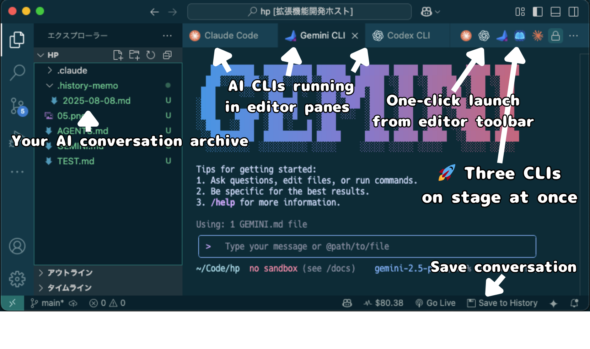

# Gemini CLI on VSCode

[🇯🇵 日本語版](README-ja.md) | **🇺🇸 English**

## 🎤 Three AI CLIs and One Extension - "We be getting down with no delay"



### Finally: The Same Claude Code Experience with Gemini CLI & Codex CLI (GPT-5)

## 💡 Why This Extension is Revolutionary

- ❌ Traditional: Gemini CLI only runs in terminal
- ✅ Innovation: Editor integration with Claude Code-like experience

### 🔄 Traditional Limitations

- **Gemini CLI / Codex CLI**: Powerful but **only runs in terminal panels**
- **Gemini Code Assist**: Editor integrated but **a different tool entirely**
- **Claude Code**: Perfect editor integration but **can't use Gemini or GPT-5**

### ✨ This Extension's Innovation

#### Brings Claude Code's editor integration experience to Gemini CLI & Codex CLI

- Gemini CLI & Codex CLI (GPT-5) run directly in editor windows
- No more switching between terminal and editor
- The exact workflow Claude Code users love, now with Gemini and GPT-5
- **Industry first**: Multiple AI CLIs managed simultaneously in editor panes

## ⚡ Key Features

### 🖱️ One-Click Launch

- **Editor title bar icon** for instant access
- **Command palette** integration
- Choose between **new pane** or **active pane**

### 🔧 True Editor Integration

- Opens as an editor tab, not a terminal panel
- Side-by-side with your code files
- Maintains your editor layout

### 💻 Seamless Workflow

- Keep your code visible while using AI assistance
- No context switching between terminal and editor
- Natural integration with your development flow

### 🆕 Smart Features

#### v0.0.8 ✴️ NEW - Three CLIs on Stage!

- **Claude Code Joins the Party**: Claude Code was originally usable, but...
- **"Getting down with no delay"**: Push the "AI Brain" button for three CLIs on stage at once

#### v0.0.6 🚀 GPT-5 Launch Support!

- **Codex CLI Support**: Run OpenAI's Codex CLI (GPT-5 powered) in editor panes
- **Universal History**: Works with all terminals (Gemini CLI, Codex CLI, Claude Code, bash, zsh)
  - Unified history folder `.history-memo/` for daily work logs
  - Optional terminal name in history entries
- **Individual CLI Commands**: Dedicated commands for each CLI
  - Gemini CLI: Send Selected Text / File Path / Open File Path
  - Codex CLI: Send Selected Text / File Path / Open File Path
- **Advanced Settings**:
  - `gemini.enabled` / `codex.enabled` - Enable/disable each CLI
  - `gemini.showInContextMenu` / `codex.showInContextMenu` - Context menu visibility
  - `saveToHistory.showStatusBar` - Status bar visibility control
  - `saveToHistory.includeTerminalName` - Include terminal name in history

## 🚀 Quick Start

### Prerequisites

```bash
# Install Gemini CLI (for Gemini)
npm install -g @google/gemini-cli
gemini  # Google account authentication

# Install Codex CLI (for GPT-5)
npm install -g codex
codex   # OpenAI account authentication

# Install Claude CLI (for Claude)
npm install -g @anthropic-ai/claude-cli
claude  # Anthropic account authentication
```

### Usage

1. **Open any project in VS Code**
2. **Click the icon in the editor title bar**
   - 🚀 **Launch All CLIs** - Launch three CLIs at once
   - ✨ Launch Gemini CLI
   - ❄️ Launch Codex CLI
   - ✴️ Launch Claude Code
3. **AI CLI launches in a new editor pane!**

### 🎨 Customizing Editor Title Bar Buttons

**To hide buttons:**
- **Right-click** on any button in the editor title bar
- **Uncheck** the command from the menu

**To show buttons again:**
- **Right-click** on empty space in the editor title bar  
- **Check** the hidden commands in the menu

💡 **Tip**: Even with buttons hidden, all features remain accessible via Command Palette (`Cmd/Ctrl+Shift+P`).

Or use Command Palette:

1. **Press `Cmd+Shift+P` (Mac) or `Ctrl+Shift+P` (Windows/Linux)**
2. **Search for "Gemini CLI" or "Codex CLI"**
3. **Choose your preferred launch mode**

### 📁 Send Files/Folders to AI CLI

**Send from Explorer**

- Right-click file or folder
- Select "Gemini CLI: Send File Path" or "Codex CLI: Send File Path"
- Supports multiple selection (Ctrl/Cmd+click)

**Send from Editor Tab**

- Right-click on editor tab
- Choose your preferred CLI command

**Send All Open Files**

- Right-click in editor
- Select "Gemini CLI: Send Open File Path" or "Codex CLI: Send Open File Path"

All paths are sent with `@` prefix to your selected CLI.

### 💾 Universal History Save

Save all terminal output to `.history-memo/YYYY-MM-DD.md`:

**From Any Terminal:**

- Select text → Click "Save to History" button in status bar
- Works with Gemini CLI, Codex CLI, bash, zsh, Claude Code, and more

**Custom Keyboard Shortcut:**

- Set your own in VSCode Keyboard Shortcuts settings

### 📤 Send to AI CLI

**Send Selected Text:**

- Select text in editor → Right-click
- "Gemini CLI: Send Selected Text" or "Codex CLI: Send Selected Text"

**Send File/Folder Paths:**

- Right-click in Explorer
- Choose your preferred CLI command
- Supports multiple selection and folders

**Send All Open Files:**

- Right-click in editor
- Choose "Send Open File Path" for your preferred CLI

### ⌨️ Command Palette

All features are available from the Command Palette:

- Open Command Palette (`Cmd+Shift+P` / `Ctrl+Shift+P`)

**Gemini CLI Commands:**

- "Gemini CLI: Start in New Pane" - Launch in new pane
- "Gemini CLI: Start in Active Pane" - Launch in active pane
- "Gemini CLI: Send File Path" - Send files/folders
- "Gemini CLI: Send Open File Path" - Send all open files
- "Gemini CLI: Send Selected Text" - Send selected text

**Codex CLI Commands:**

- "Codex CLI: Start in New Pane" - Launch in new pane
- "Codex CLI: Start in Active Pane" - Launch in active pane
- "Codex CLI: Send File Path" - Send files/folders
- "Codex CLI: Send Open File Path" - Send all open files
- "Codex CLI: Send Selected Text" - Send selected text

**Common Commands:**

- "Save to History" - Save conversation (works with all terminals)

### ⌨️ Custom Keyboard Shortcuts

Set your own keybindings:

1. Open Keyboard Shortcuts: `Cmd+K Cmd+S` (Mac) or `Ctrl+K Ctrl+S` (Windows/Linux)
2. Search for "Gemini CLI" or "Codex CLI"
3. Click the pencil icon to assign your preferred keys

## 💡 Real-World Usage Examples

### Gemini CLI Examples

#### Code Review Request

```bash
# After Gemini CLI launches in editor pane
@src/components/Button.tsx Review this component and suggest improvements
```

#### Project Architecture Analysis

```bash
@. Analyze the project architecture and explain the main design patterns
```

#### Error Resolution

```bash
@package.json @src/main.ts I'm getting build errors. Help me fix them
```

### Codex CLI (GPT-5) Examples

```bash
# Advanced code generation
@src/api.ts Implement rate limiting and caching for this API

# AI agent development
@agent.py Create an AI agent that can perform multi-step reasoning
```

## 🆚 Why Choose This Over Alternatives?

### 🎯 Perfect For

- **Developers who love Claude Code's UX** but want to use Gemini or GPT-5
- **Anyone tired** of switching between terminal and editor

### 📊 Comparison

| Feature | Gemini CLI | This Extension | Gemini Code Assist | Claude Code |
|---------|-----------|----------------|-------------------|-------------|
| **Code generation** | ✅ | ✅ | ✅ | ✅ |
| **Runs in editor pane** | ❌ (terminal) | ✅ | ❌ (sidebar) | ✅ |
| **One-click launch** | ❌ | ✅ | ✅ | ✅ |
| **Terminal-based interface** | ✅ | ✅ | ❌ | ✅ |
| **File context (@)** | ✅ | ✅ | ✅ | ✅ |
| **Send editor text** | ❌ | ✅ | ✅ | ❌ (Separate terminal) |
| **Send multiple files** | ❌ | ✅ | ✅ | ❌ |
| **Universal history** | ❌ | ✅ | ❌ | ❌ |
| **Gemini models** | ✅ | ✅ | ✅ | ❌ |
| **GPT-5 models** | ❌ | ✅ | ❌ | ❌ |
| **Multiple CLI management** | ❌ | ✅ | ❌ | ❌ |

## ⚙️ Configuration Options

### Available Settings

```json
{
  // Enable/disable CLI features
  "gemini-cli-vscode.gemini.enabled": true,
  "gemini-cli-vscode.codex.enabled": true,
  
  // Context menu visibility
  "gemini-cli-vscode.gemini.showInContextMenu": true,
  "gemini-cli-vscode.codex.showInContextMenu": false,
  
  // History save settings
  "gemini-cli-vscode.saveToHistory.showStatusBar": true,
  "gemini-cli-vscode.saveToHistory.includeTerminalName": true
}
```

Settings explained:

- `enabled`: Controls CLI features and editor title bar icon visibility
- `showInContextMenu`: Controls command visibility in right-click menus
- `saveToHistory.showStatusBar`: Shows/hides "Save to History" status bar button
- `saveToHistory.includeTerminalName`: Includes terminal name in history entries

## 🛠️ Development

### Local Development

```bash
git clone https://github.com/d3j/gemini-cli-on-vscode.git
cd gemini-cli-on-vscode
npm install
npm run compile
```

### Debugging

1. Open the project in VS Code
2. Press `F5` to launch Extension Development Host
3. Test the extension in the new VS Code window

## 🐛 Troubleshooting

### Common Issues

#### Q: "gemini: command not found" error

```bash
# Solution: Install Gemini CLI
npm install -g @google/gemini-cli
```

#### Q: Authentication error

```bash
# Solution: Authenticate directly in terminal first
gemini
# Complete browser authentication, then retry extension
```

#### Q: Extension not appearing in editor title bar

- Ensure you have an active editor open
- Try reloading VS Code window (`Cmd+R` / `Ctrl+R`)

### 🔧 Output Freezing Prevention

This extension automatically prevents flow control issues when launching Gemini or Codex CLI by applying `stty -ixon`.

**Note:** This addresses a known VS Code integrated terminal issue with long, rapid outputs.

## 🤝 Contributing

Bug reports, feature requests, and pull requests are welcome!

- **Bug Reports**: [Issues](https://github.com/d3j/gemini-cli-on-vscode/issues)
- **Feature Requests**: [Issues](https://github.com/d3j/gemini-cli-on-vscode/issues)
- **Pull Requests**: [Pull Requests](https://github.com/d3j/gemini-cli-on-vscode/pulls)

## 🙏 Acknowledgments

- [Gemini CLI](https://github.com/google-gemini/gemini-cli) by Google
- [Claude Code](https://claude.ai/claude-code) by Anthropic
- VS Code Extension developer community

### 🎨 Icon Credits

Icons used in this extension are property of their respective owners:

- **AllCLIs-icon.png** - [Irasutoya](https://www.irasutoya.com/)
- **claude-logo.png** - Anthropic
- **codex-icon.png** - OpenAI
- **icon.png** (Gemini) - Google

※ Company logos are used for identification purposes only. This extension has no official affiliation with these companies.

---

## 📈 If You Like This Extension

⭐ **Please star on GitHub!**
🐛 **Report any bugs you find**
💡 **Share your feature ideas**
📢 **Share with your team**

[⭐ Star on GitHub](https://github.com/d3j/gemini-cli-on-vscode) | [🐛 Report Bug](https://github.com/d3j/gemini-cli-on-vscode/issues) | [💡 Request Feature](https://github.com/d3j/gemini-cli-on-vscode/issues)

## 📄 License

MIT License - See [LICENSE](LICENSE) file for details

## 👤 Author

**Joji Jorge Senda** ([@d3j](https://github.com/d3j))

---

Born from the daily frustration of switching between terminal and editor while using AI coding assistants. This extension brings the best of both worlds - Claude Code's elegant editor integration with Gemini CLI's powerful capabilities. This documentation expects to make a mundane extension seem like a world-changing feature. But maybe that's okay. If a small tool solves someone's small problem, the world becomes a little better.
