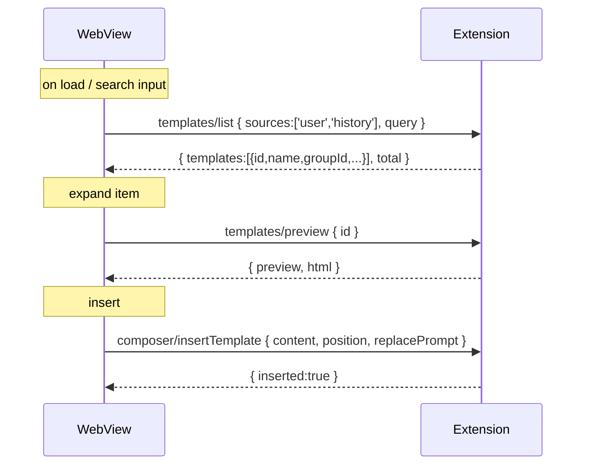

# テンプレート機能 設計書（v0.4.0）

本書は MAGUS Templates（テンプレート機能）の現行仕様をまとめた設計書です。

## 目的 / ゴール
- プロンプトの再利用を高速化（検索→プレビュー→挿入を一画面で完結）
- 複数のテンプレート由来（ユーザーファイル、履歴）を一元的に扱う
- 大量化に耐える表示（グループ化・必要時に展開・遅延プレビュー）

## ソースとファイル処理
- user（設定ファイル群）
  - 設定キー: `gemini-cli-vscode.templates.files`（UIでは1行=1パス）
  - 各ファイルの扱い:
    - 先頭が front matter（`---`）なら「MAGUS形式」と判定し、そのファイル全体を1テンプレートとして扱う
    - それ以外は通常Markdownとして扱い、H1（`# ...`）でセクション分割
- history（履歴）
  - `.history-memo/YYYY-MM-DD.md` の「最新日」だけを対象
  - H1（`# ...`）でセクション分割し、各セクションをテンプレートとして扱う
  - 履歴保存フォーマットは H1 行（例: `# [10:24:32] - MAGUS Council → gemini, codex, claude`）、冒頭の日付ヘッダは書き出さない

備考
- 現行実装では、MAGUS形式ファイルの front matter はメタ抽出に利用しますが、コンテンツはファイル全文（front matter含む）を挿入対象としています（要件に応じて将来、本文のみ抽出へ拡張可能）。

## グルーピングと並び順
- グループ単位: 「ファイルごと」にグループ化
- グループ順序: `templates.files` の定義順（0,1,2,...）。履歴グループは末尾付近（内部的に高い順序）
- グループ内順序: H1の出現順（MAGUS形式は1件）

TemplateMeta 拡張（主なフィールド）
- `groupId`: グループ一意キー（例: `userfile:<base64url(path)>` / `history:YYYY-MM-DD`）
- `groupName`: 表示名（ファイル名や `History YYYY-MM-DD`）
- `groupOrder`: グループの表示順
- `order`: グループ内の表示順（H1 index）

ID 命名
- user: `user:<base64url(path)>` または `user:<base64url(path)>#<index>`
- history: `history:YYYY-MM-DD` または `history:YYYY-MM-DD#<index>`

## IPC / API
- WebView → Extension
  - `templates/list` payload: `{ sources?: ('user'|'history')[], query?: string, limit?: number, offset?: number }`
  - `templates/get` payload: `{ id: string }`
  - `templates/preview` payload: `{ id: string, values?: Record<string, any> }`
  - `templates/render` payload: `{ id: string, values?: Record<string, any> }`
  - `composer/insertTemplate` payload: `{ content: string, position: 'head'|'cursor'|'tail', replacePrompt?: boolean, sourceId?: string }`
- Extension → WebView
  - `result` with `{ templates, total, hasMore }` / `{ template }` / `{ preview, html }` / `{ content }`
  - `error` with `{ error }`

## WebView（UI）
- グループ（ファイル名）を折りたたみ/展開可。初回は先頭グループを展開
- 項目クリックでプレビュー取得（遅延）しキャッシュ
- [Head]/[Cursor]/[Tail]/[Replace] で MAGUS Council のプロンプトへ挿入
- 検索欄の [×/⟳] で「クリア/リフレッシュ」

## セキュリティ / パフォーマンス
- 文字列上限・タイムアウト（既定）
  - `sizeLimitKb: 512`
  - `timeoutMs: 1500`
- プレビューHTMLは `toSafeHtml` で基本エスケープ（WebView側のCSPも併用）
- 大規模ファイル/大量セクションへの対策
  - グループ折りたたみ（必要なときに展開）
  - プレビューは展開時に初回生成しキャッシュ

## 設定キー
- `gemini-cli-vscode.templates.enabled`（bool, default: true）
- `gemini-cli-vscode.templates.files`（string[]）
  - Settings UIでは "Add Item" で1行=1パスを追加
  - 相対パスはワークスペースルートを基準

## 非目標 / 破棄
- 共有ディレクトリ設定（`templates.sources.shared.*`）は廃止
- 過去日の履歴展開は行わない（最新日のみ）

## 将来拡張
- ディレクトリ/グロブ指定のサポート（例: `docs/prompts/**/*.md`）
- MAGUS形式コンテンツの front matter 除去（本文のみ編集/挿入）
- グループ展開状態の永続化（キー別）や仮想リスト対応
- テンプレの利用頻度ベースの並び替え/ピン留め
- 信頼情報（署名/検証）のUI表示・フィルタリング

